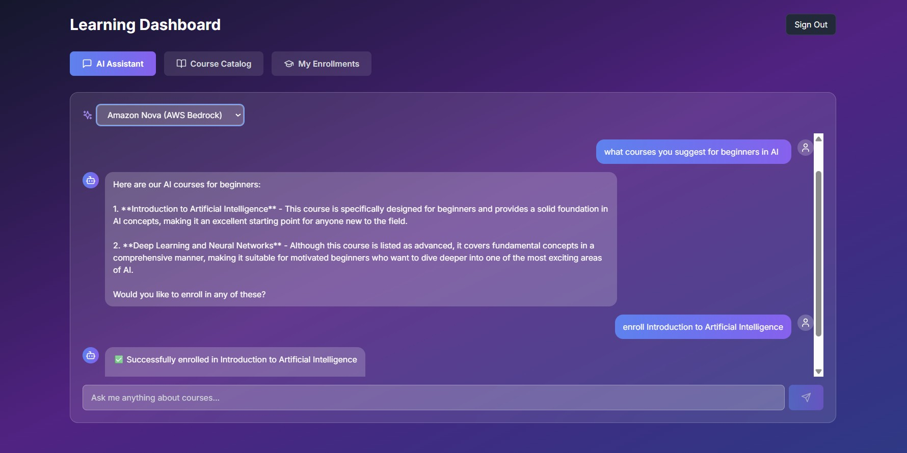

# LMS Platform - AI-Powered Learning Management System

A modern Learning Management System with AI-powered chat assistance for courses in AI, DevOps, Docker, and Kubernetes.

## 📸 Screenshots

### Landing Page


_Modern landing page with terminal-style status display_

### Dashboard


_Main dashboard with navigation and course overview_

### AI Chat Assistant


_Natural language chat interface with multiple AI models_

### Course Catalog


_Browse and filter courses by category and difficulty_

### My Enrollments


_Track your enrolled courses and progress_

### Email Notifications


_Automated email notifications for enrollments_

### Slack Notifications


_Real-time Slack alerts for admin_

## ✨ Features

### Core Features

- 🤖 **AI-Powered Chat Assistant** - Use natural language to discover and enroll in courses
- 🎯 **Smart Enrollment** - Simply say "enroll me in Docker" and the AI handles it
- 📚 **Course Catalog** - 10 pre-loaded courses in AI, DevOps, Docker, and Kubernetes
- 🎓 **Progress Tracking** - Monitor your learning journey with visual progress bars
- 💬 **Multi-Model Support** - Choose from Gemini, AWS Bedrock, or Mistral AI
- 📧 **Email Notifications** - Automated Gmail notifications for enrollments (admin + student)
- 💬 **Slack Integration** - Real-time Slack alerts for admin on new enrollments
- 🐳 **Fully Containerized** - One command to start everything with Docker
- 🎨 **Modern UI** - Clean, dark theme with excellent readability

### Advanced LangGraph Features

- 🔀 **StateGraph Workflow** - Proper state management with checkpointing
- 🎯 **LLM-Based Routing** - Intelligent intent detection (not just keywords)
- 📊 **Real-Time Streaming** - Multiple streaming modes (updates, values, messages, debug)
- 🔍 **State Management** - Debug conversations, time-travel, replay from checkpoints
- ✂️ **Message Trimming** - Automatic context management to prevent overflow
- ⏸️ **Advanced Interrupts** - True pause/resume for approval workflows
- 🔄 **Evaluator-Optimizer** - Quality evaluation and response refinement
- 🎭 **Orchestrator-Worker** - Complex query decomposition and parallel execution
- 🏷️ **Tag-Based Streaming** - Filter and organize streaming events
- 💾 **Checkpointing** - Resume conversations from any point
- 🔄 **Evaluator-Optimizer Pattern** - Quality evaluation and response refinement
- ⚡ **Parallelization** - Concurrent task execution with asyncio
- 🛑 **Human-in-the-Loop** - Approval workflows with interrupts
- 📊 **State Management APIs** - Debug, inspect, and control conversations
- 💬 **Advanced Streaming** - Multiple modes (values, updates, messages, debug)
- ⏮️ **Time-Travel Debugging** - Replay conversations from any checkpoint

## Tech Stack

### Backend

- **FastAPI** - Modern async web framework
- **LangGraph 1.0** - Advanced AI agent orchestration
  - StateGraph with TypedDict state management
  - Checkpointing with MemorySaver
  - Real-time streaming with multiple modes
  - State management APIs (get_state, update_state, replay)
  - Advanced interrupts with Command
  - Message trimming for context management
- **LangChain 1.0** - LLM integration and utilities
- **Pydantic** - Structured outputs and type safety
- **Tortoise ORM** - Async ORM with Aerich migrations
- **PostgreSQL** - Production database
- **Multi-Model AI Support**:
  - Google Gemini (2.5-pro, 2.5-flash, 2.5-flash-lite)
  - AWS Bedrock (Nova, Claude Sonnet)
  - Mistral AI
- **Notifications**:
  - Email with aiosmtplib (Gmail)
  - Slack webhook integration
- **Advanced Patterns**:
  - LLM-based routing (not keyword matching)
  - Evaluator-optimizer for quality control
  - Orchestrator-worker for complex queries
  - Parallel execution with asyncio

### Frontend

- Next.js 14
- TypeScript
- Tailwind CSS
- Axios for API calls

## 🚀 Quick Start

### Prerequisites

- Docker Desktop installed
- At least one AI API key (Gemini recommended - free tier available)

### Setup in 3 Steps

1. **Clone and configure**

   ```bash
   git clone <repository-url>
   cd lms-platform
   cp .env.example .env
   ```

2. **Add your API keys to `.env`**

   ```env
   # AI Models (at least one required)
   GEMINI_API_KEY=your_key_here
   AWS_ACCESS_KEY_ID=your_key_here (optional)
   AWS_SECRET_ACCESS_KEY=your_key_here (optional)
   MISTRAL_API_KEY=your_key_here (optional)

   # Email Notifications (optional)
   GMAIL_EMAIL=your_gmail@gmail.com
   GMAIL_APP_PASSWORD=your_16_char_app_password
   ADMIN_EMAIL=admin@gmail.com

   # Slack Notifications (optional)
   SLACK_WEBHOOK_URL=https://hooks.slack.com/services/YOUR/WEBHOOK/URL
   ```

3. **Start everything**
   ```bash
   docker-compose up -d --build
   ```

### Access Points

- 🌐 **Frontend**: http://localhost:3000
- 🔧 **Backend API**: http://localhost:8000
- 📚 **API Docs**: http://localhost:8000/docs

## 💡 How to Use

1. **Get Started** - Click the "Get Started" button on the landing page
2. **Enter Details** - Provide your name and email
3. **Chat with AI** - Ask questions like:
   - "What courses do you offer?"
   - "I want to learn Docker"
   - "Enroll me in Introduction to AI"
4. **Browse Courses** - Explore the course catalog and filter by category
5. **Track Progress** - View your enrollments and monitor your learning journey

## 📧 Notifications Setup

### Gmail Notifications

The platform sends automated emails when students enroll in courses:

- **Admin Email**: Enrollment notification with student and course details
- **Student Email**: Welcome email with course information and next steps

**Setup:**

1. Enable 2-Step Verification on your Google Account
2. Generate an App Password: https://myaccount.google.com/apppasswords
3. Add credentials to `.env`:
   ```env
   GMAIL_EMAIL=your_gmail@gmail.com
   GMAIL_APP_PASSWORD=your_16_char_app_password
   ADMIN_EMAIL=admin@gmail.com
   ```

### Slack Notifications

Get real-time enrollment alerts in your Slack workspace.

**Setup:**

1. Follow the detailed guide in [slack.md](slack.md)
2. Create a Slack app and incoming webhook
3. Add webhook URL to `.env`:
   ```env
   SLACK_WEBHOOK_URL=https://hooks.slack.com/services/YOUR/WEBHOOK/URL
   ```

**Note:** Both notification systems are optional. The platform works without them.

## Database Migrations

Initialize database (first time only):

```bash
docker-compose exec backend aerich init-db
```

## API Endpoints

### Core APIs

- `GET /api/courses` - List all courses
- `GET /api/courses/{id}` - Get course details
- `POST /api/students` - Create student
- `POST /api/enrollments` - Enroll in course
- `POST /api/chat` - Send message to AI assistant
- `GET /api/chat/models` - List available AI models
- `GET /api/chat/history/{student_id}` - Get chat history

### Agent & Visualization

- `POST /api/agent/stream` - Stream agent processing with SSE
- `GET /api/agent/graph` - Get graph structure for visualization
- `GET /api/agent/graph/mermaid` - Get Mermaid diagram
- `POST /api/agent/approve` - Approve pending actions

### State Management (Debug & Control)

- `POST /api/state/get-state` - Get current conversation state
- `POST /api/state/get-state-history` - Get full execution history
- `POST /api/state/update-state` - Manually update state (undo actions)
- `POST /api/state/replay` - Replay from checkpoint
- `POST /api/state/resume` - Resume interrupted conversation
- `GET /api/state/threads` - List all conversation threads
- `DELETE /api/state/thread/{id}` - Delete conversation thread

### Advanced Streaming

- `POST /api/streaming/stream-advanced` - Stream with mode selection (updates/values/messages/debug)
- `POST /api/streaming/stream-with-tags` - Stream with tag filtering

## Project Structure

```
lms-platform/
├── backend/
│   ├── ai/
│   │   ├── __init__.py
│   │   ├── agent.py              # LangGraph StateGraph implementation
│   │   ├── models.py             # AI model configurations
│   │   ├── tools.py              # Agent tools
│   │   └── phase3_nodes.py       # Advanced node implementations
│   ├── api/
│   │   ├── __init__.py
│   │   ├── chat.py               # Chat endpoints
│   │   ├── courses.py            # Course management
│   │   ├── students.py           # Student management
│   │   ├── enrollments.py        # Enrollment management
│   │   ├── agent_viz.py          # Agent visualization & streaming
│   │   ├── state_management.py   # State management APIs
│   │   └── streaming.py          # Advanced streaming APIs
│   ├── migrations/               # Database migrations
│   ├── models.py                 # Tortoise ORM models
│   ├── database.py               # DB initialization
│   ├── email_service.py          # Email and Slack notifications
│   ├── main.py                   # FastAPI app
│   ├── visualize_graph.py        # Graph visualization script
│   ├── test_email.py             # Email notification tests
│   ├── test_enrollment_matching.py  # Enrollment matching tests
│   ├── aerich_config.py          # Aerich migration config
│   ├── requirements.txt          # Python dependencies
│   ├── pyproject.toml            # Poetry configuration
│   └── Dockerfile                # Backend container
├── frontend/
│   ├── app/
│   │   ├── agent-demo/           # Agent demo page
│   │   ├── globals.css           # Global styles
│   │   ├── layout.tsx            # Root layout
│   │   └── page.tsx              # Home page
│   ├── components/
│   │   ├── AgentWorkflowVisualization.tsx  # Agent graph visualization
│   │   ├── ChatInterface.tsx     # Main chat component
│   │   ├── CourseCatalog.tsx     # Course browsing
│   │   ├── Dashboard.tsx         # Main dashboard
│   │   ├── LandingPage.tsx       # Landing page with terminal display
│   │   ├── MyEnrollments.tsx     # Enrollment tracking
│   │   └── StreamingChat.tsx     # Streaming chat interface
│   ├── lib/
│   │   └── api.ts                # API client
│   ├── next.config.js            # Next.js configuration
│   ├── tailwind.config.js        # Tailwind CSS config
│   ├── tsconfig.json             # TypeScript config
│   ├── package.json              # Node dependencies
│   └── Dockerfile                # Frontend container
├── screenshots/
│   ├── 0.jpg                     # Landing page
│   ├── 1.jpg                     # Dashboard
│   ├── 2.jpg                     # Chat interface
│   ├── 3.jpg                     # Course catalog
│   ├── 4.jpg                     # My enrollments
│   ├── 5.emailnotification.jpg   # Email notification
│   └── 6.slacknotifications.jpg  # Slack notification
├── .env.example                  # Environment variables template
├── .gitignore                    # Git ignore rules
├── docker-compose.yml            # Docker orchestration
├── LICENSE                       # MIT License
├── README.md                     # This file
├── SETUP.md                      # Setup instructions
└── slack.md                      # Slack integration guide
```

## 🔀 LangGraph Agent Architecture

The AI agent uses **LangGraph 1.0 StateGraph** with advanced features for production-ready orchestration.

### Workflow

```
START → load_courses → llm_router → [intent-based routing] → evaluator → optimizer → generate_suggestions → END
                                    ↓
                            [course_discovery, enrollment, recommendation, general_qa, complex_query]
                                    ↓
                            check_approval (for enrollments)
                                    ↓
                            orchestrator → worker (for complex queries)
```

### Intent-Based Routing (LLM-Powered)

- **course_discovery**: Browse and search courses
- **enrollment**: Enroll in courses (with approval workflow)
- **recommendation**: Get personalized recommendations
- **general_qa**: General questions and conversation
- **complex_query**: Multi-step queries requiring decomposition

### Advanced Features

#### State Management

- **Checkpointing**: Resume conversations from any point
- **State APIs**: Get, update, replay conversation state
- **Time-Travel Debugging**: Inspect full execution history
- **Manual Corrections**: Undo enrollments, fix mistakes

#### Quality Control

- **Evaluator-Optimizer**: Automatic quality evaluation and refinement
- **Response Scoring**: Quality scores with feedback
- **Iterative Refinement**: Up to 2 refinement iterations

#### Complex Workflows

- **Orchestrator-Worker**: Decompose complex queries into subtasks
- **Parallel Execution**: Process subtasks concurrently with asyncio
- **Task Synthesis**: Combine results into comprehensive response

#### Approval Workflows

- **Advanced Interrupts**: True pause/resume with `interrupt()` and `Command`
- **Bulk Enrollment Protection**: Requires approval for >3 courses
- **Resume API**: Approve/reject and continue execution

#### Context Management

- **Message Trimming**: Automatic trimming to prevent overflow
- **Token Limiting**: Stay within 4000 token limit
- **History Management**: Keep last 20 messages

#### Streaming

- **Multiple Modes**: updates, values, messages, debug
- **Tag-Based Filtering**: Organize and filter events
- **Real-Time Updates**: Server-Sent Events (SSE)

### Architecture Highlights

- ✅ StateGraph with TypedDict state management
- ✅ Structured outputs with Pydantic models
- ✅ LLM-based routing (not keyword matching)
- ✅ Checkpointing with MemorySaver
- ✅ Conditional edges for dynamic routing
- ✅ Parallel execution with asyncio.gather()
- ✅ Message history with trim_messages()
- ✅ Visual workflow representation
- ✅ Modular, extensible architecture
- ✅ Production-ready error handling

### Visualize the Graph

```bash
cd backend
python visualize_graph.py
```

### Test the Agent

```bash
# Basic tests
cd backend
python test_langgraph_agent.py

# Advanced pattern tests
python test_phase3.py

# State management & streaming tests
python test_phase4.py
```

### Debug Conversations

```bash
# Get current state
curl -X POST http://localhost:8000/api/state/get-state \
  -H "Content-Type: application/json" \
  -d '{"thread_id": "student_1"}'

# Get full history
curl -X POST http://localhost:8000/api/state/get-state-history \
  -H "Content-Type: application/json" \
  -d '{"thread_id": "student_1"}'

# Undo enrollment
curl -X POST http://localhost:8000/api/state/update-state \
  -H "Content-Type: application/json" \
  -d '{
    "thread_id": "student_1",
    "values": {"enrolled": false},
    "as_node": "enrollment"
  }'
```

### Stream with Advanced Modes

```bash
# Stream with values mode (full state)
curl -X POST http://localhost:8000/api/streaming/stream-advanced \
  -H "Content-Type: application/json" \
  -d '{
    "message": "Show me AI courses",
    "stream_mode": "values"
  }'

# Stream with tags
curl -X POST http://localhost:8000/api/streaming/stream-with-tags \
  -H "Content-Type: application/json" \
  -d '{"message": "Recommend a course"}'
```

## Development

To run in development mode with hot reload:

Backend:

```bash
cd backend
pip install -r requirements.txt
uvicorn main:app --reload
```

Frontend:

```bash
cd frontend
npm install
npm run dev
```

## Implementation Status

### LangGraph Coverage: 70-75%

**Implemented:**

- ✅ Core StateGraph (100%)
- ✅ Streaming (90%)
- ✅ State Management (100%)
- ✅ Advanced Patterns (100%)
- ✅ Message Management (100%)
- ✅ Interrupts & Control (100%)
- ✅ Checkpointing (MemorySaver)

**Not Implemented (Low Priority):**

- ❌ Send() for dynamic parallelization (overkill for this scale)
- ❌ Subgraphs (unnecessary complexity)
- ❌ Production persistence (Postgres/Redis - can add later)
- ❌ Functional API (Graph API is clearer)

## Performance

- **Average Response Time**: 2-3 seconds
- **Streaming Latency**: <100ms per update
- **State Retrieval**: <50ms
- **Message Trimming**: <10ms
- **Parallel Execution**: Up to 10 concurrent tasks

## Troubleshooting

### Agent Not Responding?

Check that at least one AI API key is configured in `.env`

### Email Notifications Not Working?

Verify Gmail App Password is correct (16 characters, no spaces)

### Slack Notifications Not Working?

Check webhook URL format and test with curl (see [slack.md](slack.md))

### Context Overflow Errors?

Message trimming is automatic - check logs for trimming activity

### State Management Issues?

Ensure you've had a conversation first before querying state

## License

MIT
